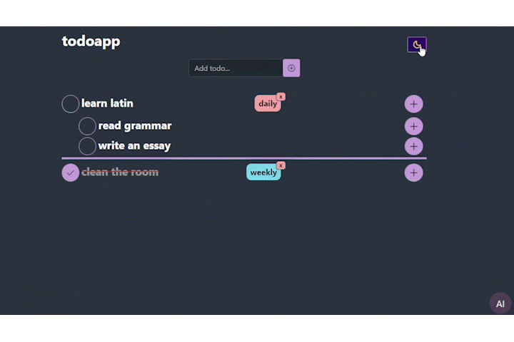

# Todolist with integrated AI chat helper

**[Check it out](https://roaring-paletas-13eae2.netlify.app/)**

## Tech stack

## AI chat helper

OpenAI API was used.

## Adding tag

There is a possibility to add tag to a task with different priority.

## Changing theme

The app have dark and white mode.

